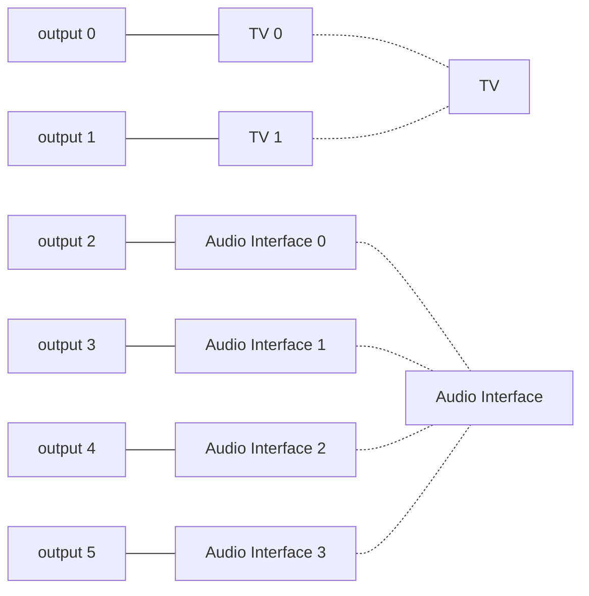

## Multi-Route
By default, when connecting several audio devices to an iOS device, the device that will actually be selected to output audio is the last one that was detected.
That is, unless the `AVAudioSession` is set up using the [`multiRoute`](https://developer.apple.com/documentation/avfaudio/avaudiosession/category/1616484-multiroute) category. When it's the case, all detected audio devices will be gathered in the aggregate device generated for `AVAudioEngine`. Thus, the output format will have a number of channels that is equal to the sum of the channels of each audio device.

For instance, let’s connect a TV with stereo output through HDMI and an audio interface with 4 output channels through USB-A. An adapter with those two ports is connected to an iPad through USB-C. The channels count of the engine's output node will be 6.



## Device Selection
If the user selects a device - regardless of how the UI presents the choice - it's required to use channel mapping to route the audio stream to the corresponding channels.

To show how this articulates in practice, we will work with a stereo output stream that we want to route to either a stereo TV plugged to a HDMI port or a stereo audio interface plugged to a USB-A port.

### Player
The audio logic will lie in a `Player` class.

```swift
final class Player {
    let session = AVAudioSession.sharedInstance()
    let engine = AVAudioEngine()
}
```
We already add an `AVAudioEngine` instance as well as a reference to the shared audio session.

### AudioDevice
To offer device selection we are going to need a device model to work with for convenience so let's add it.

```swift
struct AudioDevice {
    let name: String
    let port: AVAudioSession.Port
    let uid: String
    let channelsCount: Int
}
```
`AudioDevice` will map the available output devices,  e.g. the TV and the audio interface. The `name` is for display purpose, the `port` specifies how the device is plugged in (HDMI, USB, Bluetooth...), the `uid`  is an unique identifier of this device computed from the manufacturer identifier, the serial number as well as other attributes and provided by the shared session. Finally, the channels count corresponds to the available output channels of the device. So this will be 2 for both devices in this example.

Let's add a property to store the devices in the `Player` class.

```swift
var devices: [AudioDevice] = []
```

Audio devices are retrieved from the `AVAudioSession.currentRoute.outputs` property. This should be called at the initial setup but also every time the `AVAudioSession.routeChangeNotification` is triggered.

```swift
func retrieveAudioDevices() {
    devices.removeAll()

    for portDescription in session.currentRoute.outputs {
        let device = AudioDevice(
            name: portDescription.portName,
            port: portDescription.portType,
            uid: portDescription.uid,
            channelsCount: portDescription.channels?.count ?? 0
        )
        devices.append(device)
    }
}
```
> Note that the order to retrieve the audio devices is important. The engine's output node format follows the order of the `AVAudioSessionPortDescription`  inside the [`outputs`](https://developer.apple.com/documentation/avfaudio/avaudiosessionroutedescription/1616552-outputs) array.
{: .prompt-warning }

It's then possible to use the `devices` array in a picker so that the user can select a specific device as output.

> A SwiftUI `Picker` could do the job once `AudioDevice` conforms to `Identifiable` but UI is out of the scope of this article.
{: .prompt-tip }

Once the user selects a device, the `Player` class can observe that and call a function to route the audio stream to the proper channels of the engine's output node.

```swift
func setupChanelMappingForAudioDevice(_ selectedDevice: AudioDevice) {
    // 1
    var channelsStart = 0
    for device in devices {
        if device == selectedDevice {
            break
        } else {
            channelsStart += device.channelsCount
        }
    }

    // 2
    var channelMap = Array(
        repeating: -1, 
        count: Int(engine.outputNode.outputFormat(forBus: 0).channelCount)
    )
    channelMap[channelsStart] = 0
    channelMap[channelsStart + 1] = 1
    engine.outputNode.auAudioUnit.channelMap = channelMap as [NSNumber]
}
```

1. To find the channel index of the engine's output node corresponding to the selected device, we iterate over the `devices` and augment the `channelStart` property by the number of channels of the device if it's not a match. Once we exit the loop, `channelStart` points to the first channel of the selected device in the engine's output node channels.
2. We setup an array of `Int` serving as a channel map and assign it to the engine's output node.

> There are other ways to do channel mapping. To learn more about this topic, read [Channel Mapping](https://moredocs.github.io/posts/channel-mapping/).
{: .prompt-info }

After calling `setupChanelMappingForAudioDevice(_:)`, the stereo audio stream should be heard in through the selected device.

Of course there are plenty of other scenarios where you might want to route audio differently. You might have a mono stream, have more than two output devices, more than two channels per device, and so on. So you might be interested in reading the article dealing with channel mapping mentioned in the info prompt.

Similarly, device selection comes in many flavors. On iOS, you might prefer to ask the user only for a port type and then find the first device corresponding to this port type. This is more robust if the specific audio device isn't relevant and the user wants to always play audio through USB for instance.

You can find a basic implementation of `Player` and `AudioDevice` in the [post resources](https://github.com/MoreDocs/moredocs.github.io/blob/main/_posts_resources/2024-07-04-audio-device-selection-on-ios).